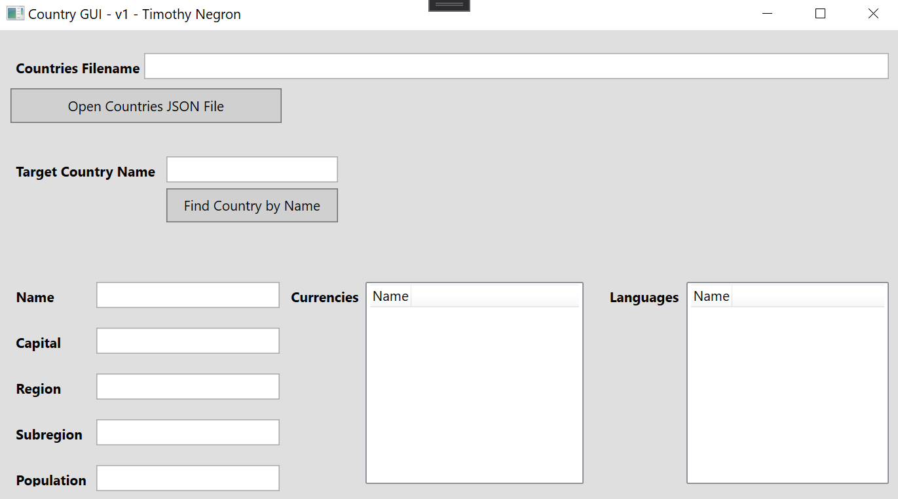
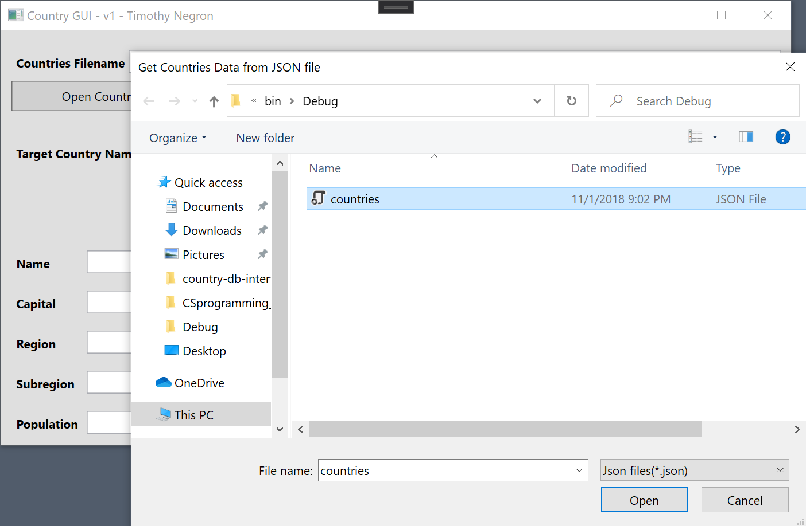
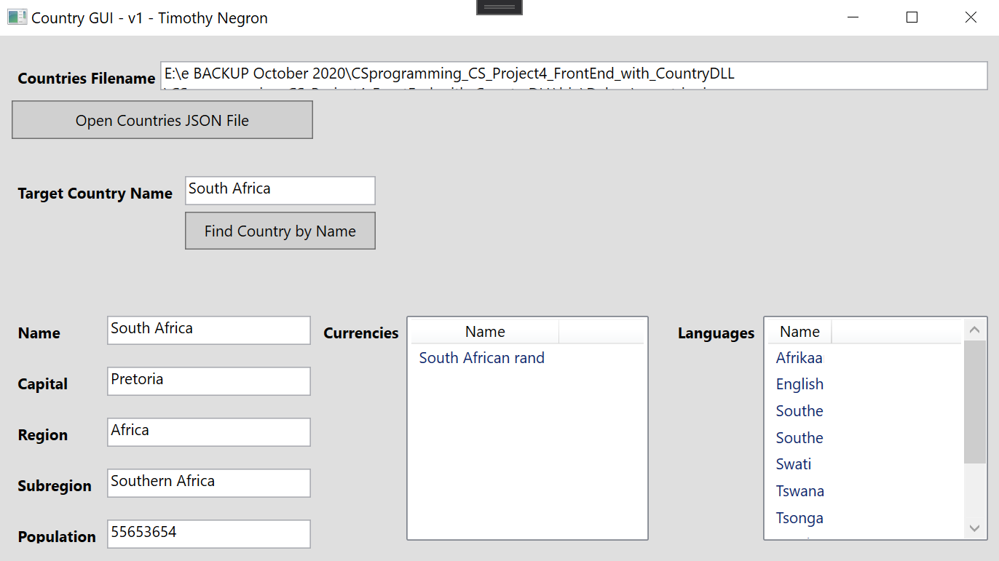
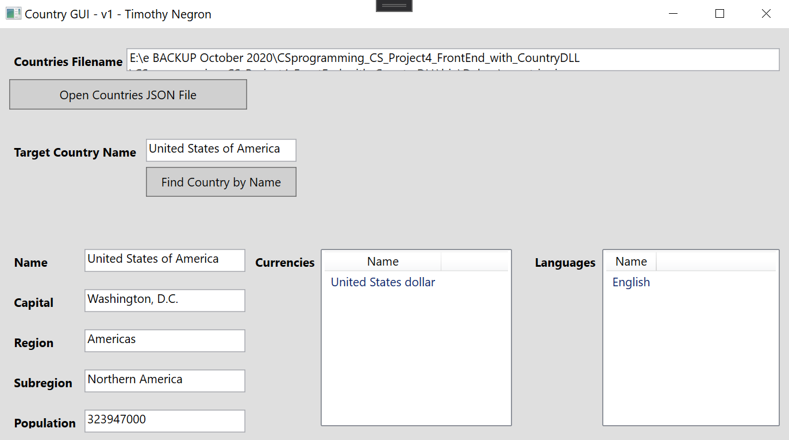

# Countries JSON Dataset Interface

### About 

A WPF interface that gives users access to a dataset related to countries that are stored on a JSON file.

### Built With

* [C#](https://docs.microsoft.com/en-us/dotnet/csharp/)
* [XAML](https://docs.microsoft.com/en-us/dotnet/desktop/wpf/fundamentals/xaml?view=netdesktop-5.0)
* [WPF](https://docs.microsoft.com/en-us/dotnet/desktop/wpf/introduction-to-wpf?view=netframeworkdesktop-4.8#program-with-wpf)
* [DLL](https://docs.microsoft.com/en-us/windows/win32/dlls/about-dynamic-link-libraries)
* [ListBox](https://docs.microsoft.com/en-us/dotnet/api/system.windows.forms.listbox?view=net-5.0)
* [OpenFileDialog](https://docs.microsoft.com/en-us/dotnet/api/system.windows.forms.openfiledialog?view=net-5.0)
* [JSON Serialization and Deserialization](https://docs.microsoft.com/en-us/dotnet/standard/serialization/system-text-json-how-to?pivots=dotnet-5-0)

### Images

